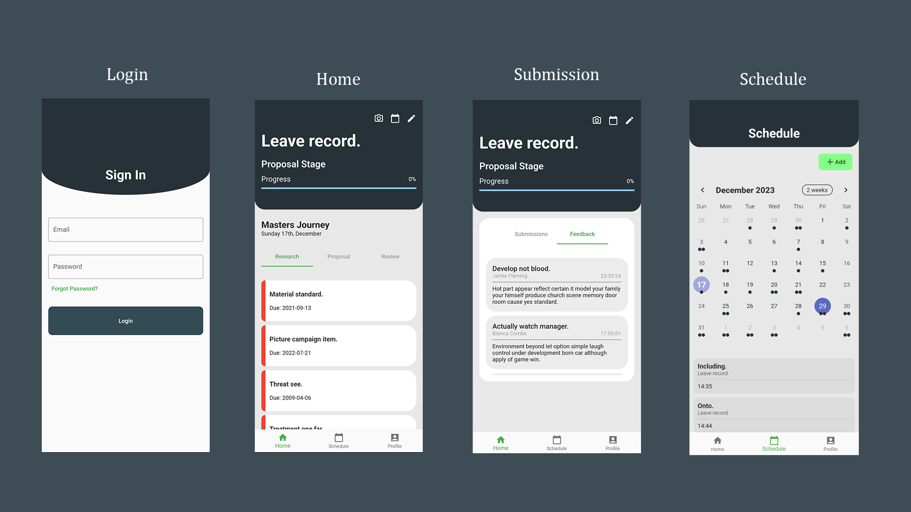

# Masters Supervision Applicaiton
An application used to supervise students undertaking a masters degree research. The application is developed using the [Flutter](https://flutter.dev/) mobile application framework. This is a prototype developed as part of the [ICT-4MRPQ](https://ict-4mrpq.uccsri.com/deliverables/) mobile application hackathon



## Features
1. Student signup and authentication
2. Student research work submission
3. Supervisor can review and comment student's research
4. Ability to keep track of all upcoming deadlines using a calendar
5. Research proposal stage tracking using the predefined categories `Research`, `Proposal`, `Review` stages

## Requirements
1. [Flutter](https://docs.flutter.dev/get-started/install)
2. [Android Studio](https://developer.android.com/codelabs/basic-android-kotlin-compose-install-android-studio)

## Setting up dev
1. Clone the repository into your desired directory
   ```bash
   git clone https://github.com/edgarmuyomba/mastersApp.git
   ```
2. Navigate into the created folder `mastersApp` using the terminal
3. Install the necessary dependencies.
   ```bash
   flutter pub get
   ```
4. Run the project.
   - Either navigate to `lib\main.dart` and click the **run** button
   - or using the terminal, run
     ```bash
     flutter run
     ```

## Built with
1. [File Picker](https://pub.dev/packages/file_picker)
2. [Table Calendar](https://pub.dev/packages/table_calendar)

## Contributors
[@BirimumaasoRogers](https://github.com/BirimumaasoRogers)
[@allanalmax](https://github.com/allanalmax)